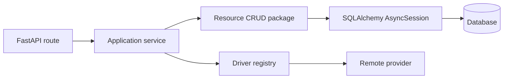

# Use Functional CRUD Modules for Persistence

Status: Accepted  
Date: 2026-07-14

## Context

Fourdrinier needs a boundary between application use cases and SQLAlchemy
persistence. Two reasonable options are function-based CRUD modules and the
repository pattern.

A repository would expose a domain-oriented interface such as
`HostRepository`, normally with a SQLAlchemy implementation and replaceable
test or alternative-storage implementations. That abstraction is valuable
when the application needs multiple persistence implementations or must keep
its application layer independent of its ORM.

Fourdrinier currently has one SQLAlchemy persistence implementation. Its host
service already owns an `AsyncSession` because the service defines transaction
boundaries across several persistence and provider operations. A repository
would therefore wrap the same session and ORM models without yet isolating the
service from SQLAlchemy. It would add constructor dependencies, interfaces,
and another directory without providing the main benefit of substitutable
persistence.

## Decision

Use asynchronous functions in `fourdrinier/db/crud/` for local persistence.
Keep separate operation modules where that layout improves discoverability.
Re-export their public functions from the resource package so callers have one
stable import boundary.



The boundaries are:

- API routes own HTTP parsing and error translation.
- Application services own use-case rules and transaction boundaries.
- CRUD functions own SQLAlchemy queries, additions, deletions, and flushes.
- CRUD functions do not commit, roll back, call remote providers, or raise
  HTTP exceptions.
- Drivers own communication with Docker, Kubernetes, and future providers.

Host CRUD remains provider-neutral. A `Host` parent and its matching Docker or
Kubernetes details are one aggregate for persistence, so common create, read,
list, and delete operations do not branch by provider.

## Module layout

Host persistence uses a package with separate operation modules:

```text
fourdrinier/db/crud/hosts/
├── __init__.py
├── _select_hosts.py
├── create_host.py
├── delete_host.py
├── get_host.py
└── list_hosts.py
```

`__init__.py` is the public boundary. Application code imports the `hosts`
CRUD package instead of depending on individual module locations.

## Consequences

This decision keeps persistence explicit and consistent with the project's
backend standards. It also avoids introducing an abstraction that the current
application cannot meaningfully substitute.

The application service remains coupled to SQLAlchemy's session and ORM
models. Tests isolate service behavior by replacing CRUD functions, while CRUD
integration tests exercise the real database mapping.

Separate operation modules create more files than a single CRUD module. The
package-level exports limit that cost: callers see one persistence namespace,
while developers can navigate directly to the operation they are changing.

## When to reconsider

Adopt a repository, potentially together with a unit-of-work abstraction, if
one or more of these conditions becomes real:

- Fourdrinier must support multiple database or storage implementations.
- Application services should no longer import SQLAlchemy sessions or ORM
  models.
- Persistence behavior needs interchangeable in-memory implementations beyond
  ordinary mocks.
- Aggregate loading and persistence rules become complex enough that a
  domain-oriented collection interface is clearer than CRUD operations.
- Transaction coordination is moved behind a unit-of-work boundary.

The CRUD package provides a migration seam: a future repository implementation
can initially delegate to the existing CRUD functions while callers are moved
to the new interface.
