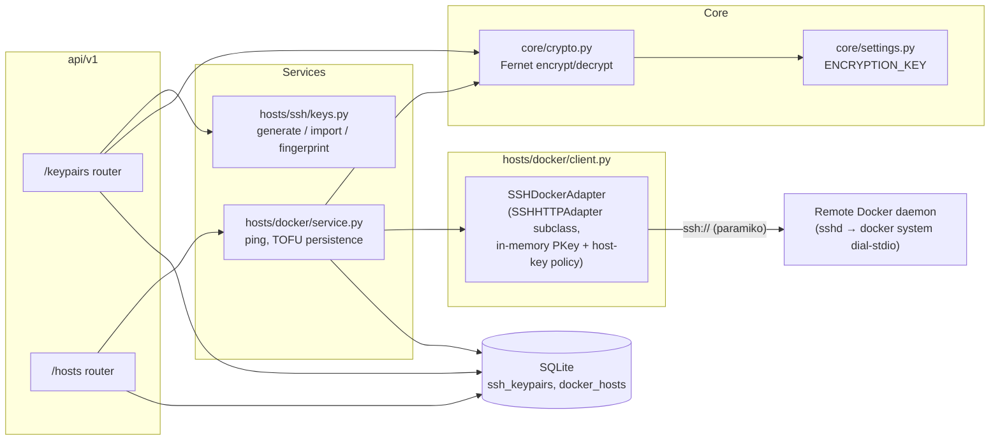
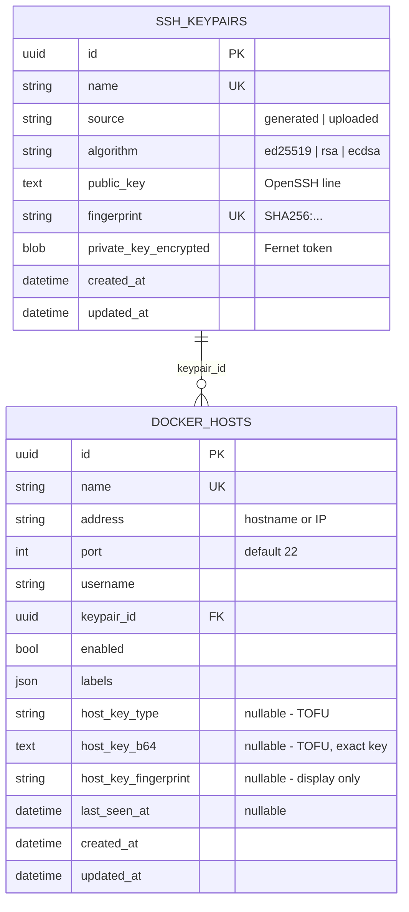
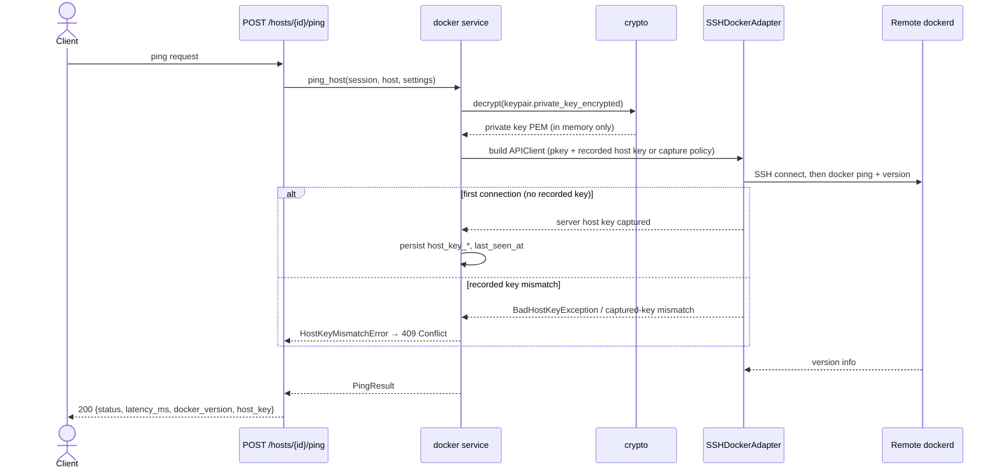

# Docker Host Configuration

This document describes how Fourdrinier manages remote Docker daemons over SSH: the data model, the connection architecture, credential handling, host-key trust, and the HTTP API.

## Overview

Fourdrinier controls Docker daemons on remote machines. A **Docker host** is registered with an address, SSH port, username, and a reference to an **SSH keypair**. The backend connects with the Docker SDK (`docker-py`) over `ssh://`, authenticating with a private key that is stored encrypted in the database and only ever handled in memory.

Design decisions:

- **Keypairs are a separate, reusable model.** One keypair can authenticate many hosts. The server can generate keypairs (ed25519) or import existing private keys.
- **Docker-only.** The earlier generic docker/kubernetes host model was replaced with a purpose-built `docker_hosts` table with typed columns. Kubernetes support, if it returns, will be its own model.
- **Trust-on-first-use (TOFU) host-key verification.** The remote server's SSH host key is recorded on the first successful connection and strictly verified afterwards; a changed key fails the connection.

## Architecture



| Layer | Module | Responsibility |
|-------|--------|----------------|
| API | `fourdrinier/api/v1/keypairs.py`, `hosts.py` | HTTP endpoints, error → status-code mapping |
| Keypair service | `fourdrinier/hosts/ssh/keys.py` | Generate ed25519 keypairs, parse uploaded keys, derive public key + fingerprint |
| Docker service | `fourdrinier/hosts/docker/service.py` | Ping orchestration: decrypt key, connect, verify/record host key, persist `last_seen_at` |
| Transport | `fourdrinier/hosts/docker/client.py` | docker-py `APIClient` construction with injected SSH credentials |
| Crypto | `fourdrinier/core/crypto.py` | Fernet encryption of secrets at rest, keyed by `ENCRYPTION_KEY` |
| Persistence | `fourdrinier/db/models/`, `db/crud/` | `SSHKeypair` and `DockerHost` ORM models and CRUD helpers |

## Data model



Notes:

- `private_key_encrypted` holds a Fernet token of the private key PEM. **No endpoint ever returns private key material** — `KeypairRead` exposes only public fields.
- The TOFU columns start `NULL` and are populated after the first successful ping. The exact base64 key is stored (not just the fingerprint) so paramiko can verify strictly on later connections; the fingerprint is for display.
- A keypair cannot be deleted while any host references it (`409 Conflict`).

## Credential handling

- **Encryption at rest.** Private keys are encrypted with [Fernet](https://cryptography.io/en/latest/fernet/) using the `ENCRYPTION_KEY` setting (see `.env.example` for the generation command). `core/crypto.py` validates the key lazily, so the app boots without one until a secret is actually used; a missing/invalid key surfaces as `503`.
- **In-memory only.** Decrypted keys are parsed into paramiko `PKey` objects from a string buffer and injected directly into the SSH session. Key material never touches the filesystem.
- **Provisioning.** `POST /keypairs` without a `private_key` generates an ed25519 keypair server-side; the response contains the OpenSSH public key line for the operator to install in the host's `~/.ssh/authorized_keys`. With a `private_key`, the key is imported (ed25519, ECDSA, or RSA; passphrase-protected keys are rejected with `422`).

## Why a custom docker-py adapter

docker-py's stock `SSHHTTPAdapter` builds its paramiko connection exclusively from ambient machine state — `~/.ssh/config`, `~/.ssh/known_hosts`, and the SSH agent — with no way to pass credentials programmatically ([docker-py#2416](https://github.com/docker/docker-py/issues/2416), [#2398](https://github.com/docker/docker-py/issues/2398)). That is wrong for a server that manages many hosts with database-stored credentials, so `SSHDockerAdapter` subclasses it to:

1. inject the decrypted key as an in-memory `PKey` (`ssh_params["pkey"]`),
2. disable agent, config, and on-disk key lookup (`allow_agent=False`, `look_for_keys=False`, no ssh-config parsing) so connections are fully determined by stored configuration,
3. install per-host host-key verification (below).

Construction detail: `docker.APIClient` builds and eagerly connects its own SSH adapter, so `build_docker_client()` creates our adapter first (the risky step), then constructs `APIClient` with `use_ssh_client=True` (its shell-out adapter is lazy and never used) and a pinned API version (skips eager version negotiation), and finally swaps our adapter onto the `http+docker://ssh` mount. Because this rides on docker-py internals, the dependency is pinned to `docker>=7.1,<8` in `pyproject.toml`; re-verify `hosts/docker/client.py` against `docker/transport/sshconn.py` on any upgrade.

The alternative — writing the key to a temp file and shelling out to `ssh` — would put secrets on disk and depend on the host's ssh binary and known_hosts; it was rejected.

## Host-key trust (TOFU)

Verification against a recorded key happens in two layers:

- The recorded key is preloaded into the paramiko client's host keys under the exact entry name (`host` or `[host]:port` for non-22 ports), so a mismatched server key raises `BadHostKeyException` **before authentication**.
- The missing-host-key policy captures (rather than rejects) unknown keys. After connecting, the service compares any captured key against the recorded one — this covers entry-name drift (e.g. a port change) — and raises `HostKeyMismatchError` on mismatch.

On a first connection (no recorded key), the captured key is persisted to the host row together with `last_seen_at` after the ping succeeds.



The blocking docker-py/paramiko work runs in a worker thread (`asyncio.to_thread`), keeping the FastAPI event loop responsive during the up-to-15s connect timeout.

## API

### `/api/v1/keypairs`

| Method | Path | Behavior |
|--------|------|----------|
| POST | `/keypairs` | Generate (no `private_key` in body) or import a keypair. `201` with public fields; `409` duplicate name/fingerprint; `422` unparseable or passphrase-protected key; `503` encryption key unconfigured |
| GET | `/keypairs` | List keypairs |
| GET | `/keypairs/{id}` | Fetch one keypair |
| DELETE | `/keypairs/{id}` | `204`, or `409` while referenced by a host |

### `/api/v1/hosts`

| Method | Path | Behavior |
|--------|------|----------|
| POST | `/hosts` | Register a host. `404` if the keypair doesn't exist; `409` duplicate name; `422` invalid address/username (characters that would change the `ssh://` URL are rejected) |
| GET | `/hosts` | List hosts |
| GET | `/hosts/{id}` | Fetch one host (includes `host_key_fingerprint`, `last_seen_at`) |
| DELETE | `/hosts/{id}` | `204` |
| POST | `/hosts/{id}/ping` | Validate connectivity end-to-end (SSH + Docker daemon) |

### Ping responses

Success (`200`):

```json
{
  "status": "ok",
  "latency_ms": 42.5,
  "docker_version": "27.0.1",
  "api_version": "1.41",
  "os": "linux",
  "arch": "amd64",
  "host_key": {
    "fingerprint": "SHA256:…",
    "key_type": "ssh-ed25519",
    "first_seen": true
  }
}
```

Error mapping:

| Condition | Typed error (`hosts/docker/errors.py`) | Status |
|-----------|----------------------------------------|--------|
| Host key differs from recorded key | `HostKeyMismatchError` | `409` |
| SSH rejected the keypair | `SSHAuthError` | `502` |
| Host or Docker daemon unreachable | `HostUnreachableError` | `502` |
| Encryption key missing/changed | `EncryptionKeyError` / `DecryptionError` | `503` |

## Operational flow

1. `POST /api/v1/keypairs {"name": "…"}` → copy `public_key` from the response into `~/.ssh/authorized_keys` for the connecting user on the Docker host. That user needs access to the Docker daemon (typically membership in the `docker` group), since the SDK runs `docker system dial-stdio` over the SSH session.
2. `POST /api/v1/hosts` with the keypair id, address, port, and username.
3. `POST /api/v1/hosts/{id}/ping` → first success records the host key fingerprint; subsequent pings verify it.

A Bruno collection covering this flow lives in `bruno/keypairs/` and `bruno/hosts/`.

If a host is legitimately reinstalled (new host key), the recorded key must be cleared to re-trust it — currently a manual DB update (`host_key_type`, `host_key_b64`, `host_key_fingerprint` → `NULL`); a reset endpoint is future work.

## Configuration

| Setting | Purpose |
|---------|---------|
| `ENCRYPTION_KEY` | Fernet key for secrets at rest. Required for keypair/host features. Rotating it invalidates stored private keys (there is no re-encryption tooling yet). |
| `DATABASE_URL` | Standard database URL; keypairs and hosts live in the main DB. |

## Out of scope / future work

- Key rotation and re-encryption after `ENCRYPTION_KEY` change
- Passphrase-protected key uploads and SSH agent support
- Host-key reset endpoint (re-TOFU after a host reinstall)
- Docker client connection pooling/reuse across requests (a ping opens and closes a fresh SSH connection)
- Background health polling (`last_seen_at` currently only updates on explicit ping)
- Kubernetes hosts

## Testing

`src/backend/tests/` covers crypto round-trips, keypair generation/import, keypair/host CRUD, and the ping path. API ping tests mock at the blocking boundary (`_ping_blocking`) so TOFU persistence and error mapping run for real; transport unit tests exercise first-seen capture, recorded-key verification, mismatch rejection, and auth-failure mapping with a fake docker client. Run with `uv run pytest` in `src/backend/`.
