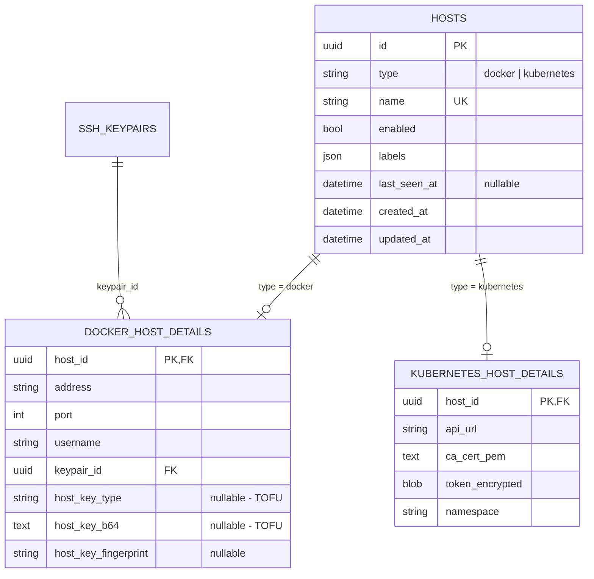
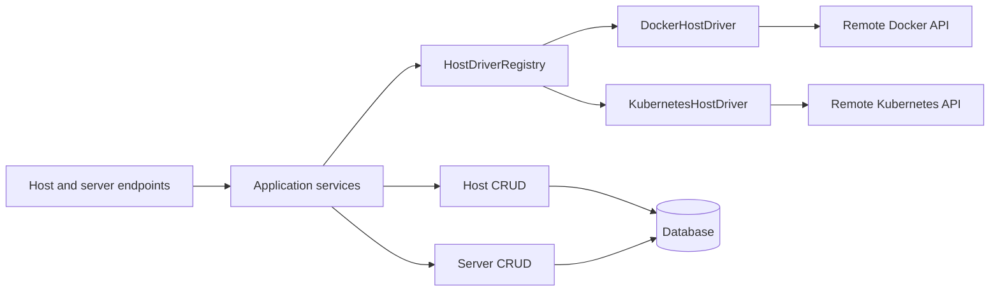

# Host Architecture

Status: Accepted — host registration and ping implemented; server lifecycle pending

This document defines how Fourdrinier represents and operates Docker and
Kubernetes hosts through one user-facing host model. It is the target
architecture for host persistence, APIs, and provider operations.

## Table of contents

- [Context](#context)
- [Goals](#goals)
- [Non-goals](#non-goals)
- [Decision summary](#decision-summary)
- [Domain and persistence model](#domain-and-persistence-model)
- [HTTP API](#http-api)
  - [Create body](#create-body)
- [Component boundaries](#component-boundaries)
  - [CRUD persistence](#crud-persistence)
  - [Application services](#application-services)
- [Host drivers](#host-drivers)
  - [Driver registry](#driver-registry)
- [Error handling](#error-handling)
- [Remote operations and consistency](#remote-operations-and-consistency)
- [Suggested module responsibilities](#suggested-module-responsibilities)
- [Migration direction](#migration-direction)
- [Alternatives considered](#alternatives-considered)
  - [Independent top-level tables](#independent-top-level-tables)
  - [One wide hosts table](#one-wide-hosts-table)
  - [JSON provider configuration](#json-provider-configuration)
  - [ORM inheritance as the primary abstraction](#orm-inheritance-as-the-primary-abstraction)
  - [Repository pattern](#repository-pattern)
  - [Passing drivers into CRUD functions](#passing-drivers-into-crud-functions)
- [Open design questions](#open-design-questions)

## Context

Fourdrinier users think in terms of adding a **host** on which Fourdrinier can
run and manage servers. A Docker daemon and a Kubernetes cluster have very
different connection details and remote APIs, but they share the same product
role and lifecycle:

- a user registers and names a host;
- the host can be enabled, labeled, listed, inspected, and deleted;
- Fourdrinier can check its connectivity;
- Fourdrinier can use it to create and operate servers.

The previous implementation exposed a unified `/hosts` API but stored Docker
and Kubernetes hosts as independent top-level database records. The host
rewrite replaced those records with the shared aggregate defined here. Server
lifecycle behavior remains pending the design decisions at the end of this
document.

## Goals

- Present one intuitive `Host` resource throughout the product and API.
- Store shared identity and lifecycle data exactly once.
- Keep Docker and Kubernetes connection data strongly typed and isolated.
- Enforce cross-provider invariants, especially host name uniqueness, in the
  database.
- Keep HTTP endpoints independent of provider-specific client code.
- Make another host provider additive rather than requiring branches in every
  endpoint.
- Give Docker and Kubernetes consistent Fourdrinier-level server operations
  where those operations have meaningful semantics for both providers.

## Non-goals

- A host does not model a physical machine. A Kubernetes host may represent an
  entire cluster.
- A host does not expose several providers simultaneously. Each host has
  exactly one provider type and one matching details record.
- Docker and Kubernetes transports, credentials, and remote object models do
  not need a common implementation.
- Backward compatibility with request bodies that omit `type` is not required.
- Provider details will not be stored as an untyped JSON document or nested
  under a `config` property in the HTTP API.

## Decision summary

1. `Host` is the shared aggregate and user-facing term.
2. A `hosts` parent table owns identity and lifecycle fields.
3. Docker and Kubernetes details live in one-to-one child tables.
4. `POST /hosts` accepts a flat, discriminated union of provider-specific
   Pydantic schemas. The `type` field is required.
5. A `HostDriver` contract defines remote host operations, with
   `DockerHostDriver` and `KubernetesHostDriver` implementations.
6. A driver registry selects an implementation by `host.type`.
7. Application services coordinate CRUD persistence functions and drivers.
   CRUD modules are responsible only for database persistence.

## Domain and persistence model



Both child-table primary keys are also foreign keys to `hosts.id` with
`ON DELETE CASCADE`. The parent row therefore owns the lifetime of its details.

The model must maintain these invariants:

- `hosts.name` is unique across all host types.
- `hosts.type` is one of the registered provider types.
- every host has exactly one details row;
- the details row matches `hosts.type`;
- a details row cannot exist without its parent host.

Parent and child creation occurs in one database transaction. The application
constructs a `Host` plus the matching details object, while the database owns
global identity constraints and referential integrity.

The ORM should use explicit one-to-one composition rather than a wide table
with nullable provider columns. Suggested relationship names are
`docker_details` and `kubernetes_details`. The ORM relationship structure does
not dictate the API representation; response mapping can flatten the selected
details into the appropriate read schema.

## HTTP API

Hosts remain one collection:

| Method | Path | Responsibility |
|--------|------|----------------|
| `POST` | `/hosts` | Create a Docker or Kubernetes host |
| `GET` | `/hosts` | List hosts, optionally filtered by type |
| `GET` | `/hosts/{host_id}` | Read any host |
| `DELETE` | `/hosts/{host_id}` | Delete the parent and its details |
| `POST` | `/hosts/{host_id}/ping` | Check the selected provider end to end |

### Create body

`POST /hosts` has one request body whose type is a discriminated union. It does
not have two body parameters or separate provider endpoints.

```python
class HostCreateBase(BaseModel):
    model_config = ConfigDict(extra="forbid")

    name: str
    enabled: bool = True
    labels: dict[str, str] = Field(default_factory=dict)


class DockerHostCreate(HostCreateBase):
    type: Literal["docker"]
    address: str
    port: int = 22
    username: str
    keypair_id: UUID


class KubernetesHostCreate(HostCreateBase):
    type: Literal["kubernetes"]
    api_url: HttpsUrl
    ca_cert_pem: str
    token: str
    namespace: str = "fourdrinier"


HostCreate = Annotated[
    DockerHostCreate | KubernetesHostCreate,
    Field(discriminator="type"),
]
```

`type` selects the only schema against which Pydantic validates the request.
A missing or unknown type, missing provider fields, or fields belonging to the
wrong provider produce `422 Unprocessable Entity`. Forbidding extra fields is
important because it prevents a mistyped provider payload from being silently
accepted after irrelevant fields are discarded.

Requests and responses remain flat. For example:

```json
{
  "type": "kubernetes",
  "name": "production",
  "api_url": "https://192.168.1.30:6443",
  "ca_cert_pem": "-----BEGIN CERTIFICATE-----\n...",
  "token": "...",
  "namespace": "fourdrinier",
  "enabled": true,
  "labels": {"environment": "production"}
}
```

The create and read schemas remain distinct so secrets and bulky trust
material are not returned. `KubernetesHostRead`, for example, does not expose
the bearer token or CA certificate.

Separate `POST /docker-hosts` and `POST /kubernetes-hosts` endpoints were
rejected because they would split creation while all other lifecycle
operations use the shared host collection. Separate creation endpoints should
only be reconsidered if the HTTP workflows become fundamentally different,
such as requiring different content types, authorization, or asynchronous
provisioning behavior.

## Component boundaries



### CRUD persistence

CRUD modules perform local persistence only. The host CRUD package owns
operations such as loading a host with its details, listing and filtering
hosts, and deleting a host. It does not communicate with Docker or Kubernetes
and does not receive a driver as an argument.

CRUD functions should generally add, query, delete, or flush ORM objects. The
calling application service owns the transaction boundary so changes to a host
and its details can be committed atomically. The rationale and conditions for
reconsidering a repository abstraction are recorded in
[ADR 0001](decisions/0001-functional-crud-for-persistence.md).

### Application services

Application services implement Fourdrinier use cases. They load the relevant
records through CRUD functions, select the driver, perform the remote operation,
and then persist the resulting local state.

For example, starting a server follows this flow:

1. `ServerService` loads the server and its host.
2. It asks `HostDriverRegistry` for the driver registered for `host.type`.
3. It calls `driver.start_server(host, server)`.
4. After remote success, it updates and commits the local server state.
5. A provider or domain error is translated to HTTP at the API boundary.

Endpoints therefore remain thin and do not contain `if host.type == ...`
branches.

## Host drivers

`HostDriver` is the boundary between Fourdrinier's domain and a provider's
remote API. A Python `Protocol` is suitable because it gives production
implementations and test doubles the same structurally typed contract without
requiring inheritance.

An initial contract may look like:

```python
class HostDriver(Protocol):
    type: HostType

    async def ping(self, host: Host) -> HostPingResult: ...

    async def create_server(
        self,
        host: Host,
        server: Server,
    ) -> ProviderServerState: ...

    async def start_server(self, host: Host, server: Server) -> None: ...

    async def stop_server(self, host: Host, server: Server) -> None: ...

    async def delete_server(self, host: Host, server: Server) -> None: ...
```

The precise contract should be introduced one use case at a time. It should
describe Fourdrinier semantics rather than expose Docker container or
Kubernetes workload APIs directly.

For example, Fourdrinier may define `stop_server` to mean that a server stops
running while retaining its configuration and data:

- `DockerHostDriver` may stop the corresponding container.
- `KubernetesHostDriver` may scale the corresponding workload to zero.

This difference is an implementation detail only if both behaviors satisfy
the same product promise. An operation that has no honest implementation for
one provider should not be added to a broad interface with an implementation
that raises `NotImplementedError`. It should instead be represented as an
explicit provider capability or placed on a smaller, capability-specific
interface.

The provider drivers own:

- selecting and validating the matching host details;
- decrypting or obtaining provider credentials through the appropriate
  dependency;
- constructing and closing provider clients;
- translating low-level client failures into provider or host-domain errors;
- converting provider results into Fourdrinier domain results.

They do not own HTTP status codes or general database CRUD.

### Driver registry

Drivers are registered once and selected centrally:

```python
class HostDriverRegistry:
    def __init__(
        self,
        docker: DockerHostDriver,
        kubernetes: KubernetesHostDriver,
    ) -> None:
        self._drivers: dict[HostType, HostDriver] = {
            HostType.DOCKER: docker,
            HostType.KUBERNETES: kubernetes,
        }

    def for_host(self, host: Host) -> HostDriver:
        return self._drivers[host.type]
```

The registry is injected into application services. Adding a provider requires
a details model, request/read schemas, a driver, and one registry entry; it
does not require new provider branches in each endpoint.

## Error handling

Drivers should translate client-library exceptions into stable Fourdrinier
errors. The application or API layer can then map those errors consistently,
for example:

| Domain condition | Example provider causes |
|------------------|-------------------------|
| Host unreachable | SSH/socket failure, Kubernetes API timeout |
| Authentication failed | SSH key rejected, bearer token rejected |
| Trust verification failed | SSH host-key mismatch, TLS verification failure |
| Permission denied | Docker socket access denied, Kubernetes RBAC denial |
| Invalid remote state | Missing container or workload, malformed response |

Provider-specific diagnostic information may be retained, but FastAPI routes
should not import Docker SDK, Paramiko, or httpx exception types.

## Remote operations and consistency

A database transaction cannot be atomic with a Docker or Kubernetes API call.
Application services must therefore define failure behavior deliberately:

- do not mark an operation successful locally until the provider succeeds;
- make driver operations idempotent where the provider permits it;
- retain provider identifiers needed to reconcile local and remote state;
- record a failed or unknown state when a remote operation may have succeeded
  but its response was lost;
- allow later reconciliation rather than assuming a database rollback undoes
  a remote side effect.

This becomes especially important for create and delete operations. The exact
server lifecycle and reconciliation model will be designed with the server
resource.

## Suggested module responsibilities

The exact filenames may evolve, but the intended dependency direction is:

```text
fourdrinier/
├── api/v1/hosts.py                 HTTP only
├── api/v1/servers.py               HTTP only
├── hosts/
│   ├── service.py                  host application use cases
│   ├── drivers.py                  protocol and registry
│   ├── docker/
│   │   ├── driver.py               DockerHostDriver
│   │   ├── operations/              One module per provider operation
│   │   ├── client.py               Docker transport construction
│   │   └── errors.py
│   └── kubernetes/
│       ├── driver.py               KubernetesHostDriver
│       ├── operations/              One module per provider operation
│       ├── client.py               Kubernetes transport construction
│       └── errors.py
├── servers/service.py              server application use cases
└── db/
    ├── models/                      Host and details persistence
    └── crud/
        ├── hosts/                   host persistence operations
        └── servers/                 server persistence operations
```

Application services depend on CRUD functions and the driver contract. Drivers
depend on provider clients. API modules depend on application services. The
reverse dependencies are not allowed.

## Migration direction

Compatibility with the existing two-table host model and implicit Docker
request type is not required. The implementation can therefore move directly
to the new contract:

1. introduce the `hosts` parent model and provider details models;
2. replace the existing top-level Docker and Kubernetes host tables with the
   child-table shapes;
3. require the request `type` discriminator and forbid extra fields;
4. replace merged provider queries with provider-neutral host CRUD operations;
5. introduce the driver protocol and registry, initially for `ping`;
6. move endpoint orchestration into application services;
7. add server lifecycle methods to the driver contract only as their shared
   semantics are defined.

If existing persistent data must later be retained, a migration can preserve
the current UUIDs while moving common columns into `hosts` and provider columns
into their matching details tables. That data migration does not require
retaining the old application interfaces.

## Alternatives considered

### Independent top-level tables

Keeping `docker_hosts` and `kubernetes_hosts` as complete sibling resources
preserves provider isolation but duplicates shared fields, prevents simple
database-enforced global identity, and makes every common operation fan out
across providers.

### One wide hosts table

A single table with nullable Docker and Kubernetes columns makes common reads
easy but weakens invariants and becomes increasingly sparse as providers are
added.

### JSON provider configuration

A JSON configuration column makes providers easy to add superficially, but it
loses database types, foreign keys, useful constraints, and clear handling of
secret material.

### ORM inheritance as the primary abstraction

Joined-table ORM inheritance could map the same physical schema, but provider
behavior should not live on persistence entities. Explicit details composition
plus application-level drivers keeps persistence and remote behavior separate.

### Repository pattern

A repository interface could isolate application services from persistence
implementations and provide interchangeable SQLAlchemy, in-memory, or other
backends. Fourdrinier currently has one SQLAlchemy implementation, and host
services own the request-scoped session to define transaction boundaries. A
repository would add indirection without currently removing that coupling.

Functional CRUD modules are therefore the chosen persistence boundary. The
repository pattern remains a valid future evolution if persistence becomes
interchangeable or a unit-of-work abstraction takes ownership of sessions and
transactions. See [ADR 0001](decisions/0001-functional-crud-for-persistence.md).

### Passing drivers into CRUD functions

This would mix local persistence with remote side effects and obscure
transaction ownership. Application services should coordinate both instead.

## Open design questions

- What is the exact Fourdrinier lifecycle of a server: create, start, stop,
  restart, delete, and possibly suspend?
- Which remote resources represent one server for each provider?
- Which provider identifiers and observed state must be stored locally?
- Which operations are universally supported, and which should be modeled as
  optional capabilities?
- How should reconciliation and background health polling represent unknown or
  partially failed remote operations?

These questions do not block the shared host model. They should be resolved
before finalizing the server-management portion of `HostDriver`.
